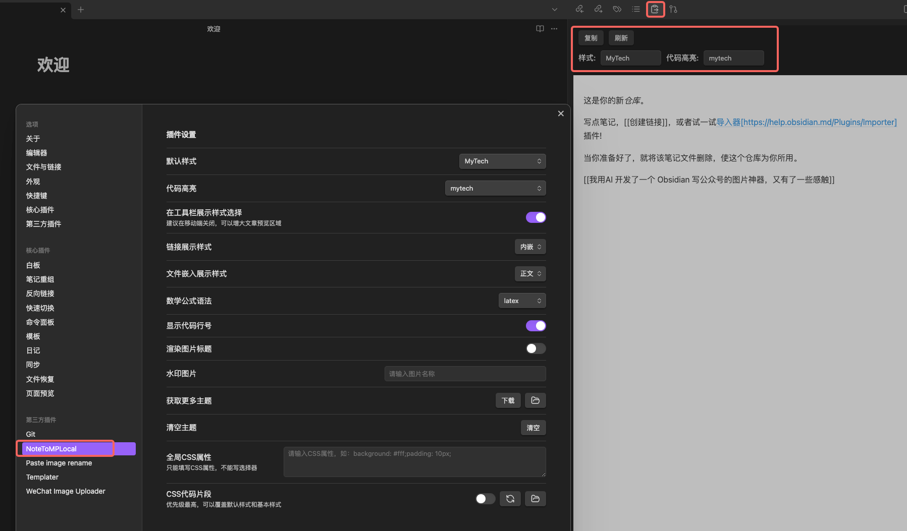

## 1、简介

 基于 [note-to-mp](https://github.com/sunbooshi/note-to-mp) 项目做的精简，主要用于本地化编译成插件，然后加载到 Obsidian 中。仅为个人使用。

这是一个Obsidian插件，针对微信公众号编缉器进行了优化，通过本插件可以实现以下功能：
1. 预览 markdown 文件在微信公众号编缉器中的样式
2. 一键复制 markdown 的预览样式（包括本地图片）到粘贴板，然后粘贴到微信公众号编缉器中时会保持样式
3. 支持代码高亮、代码行数显示、主题背景颜色等。针对微信公众号不能放链接也专门处理了，提供直接展示链接地址和文末脚注展示两种方式。

## 使用

1. 修改 update_to_obsidian.sh 脚本中的 obsidian_repo 为自己的 Obsidian 仓库的地址
2. 执行项目根目录下 update_to_obsidian.sh 脚本
3. 重启 Obsidian 软件，在插件中即可看到 NoteToMPLocal 插件
